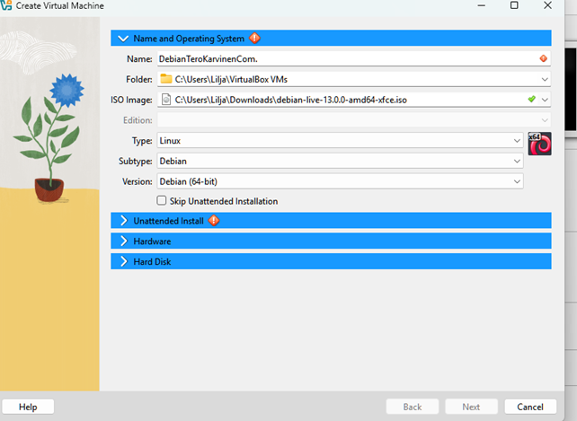
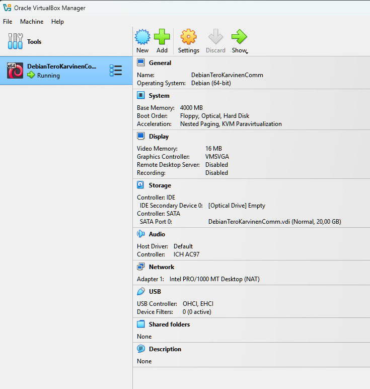
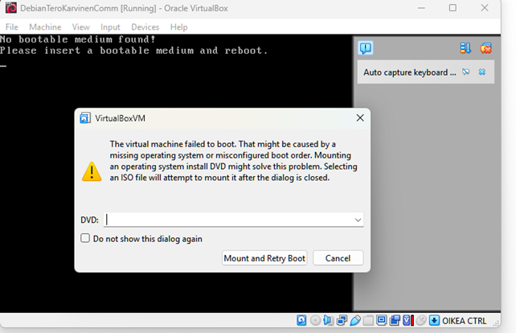
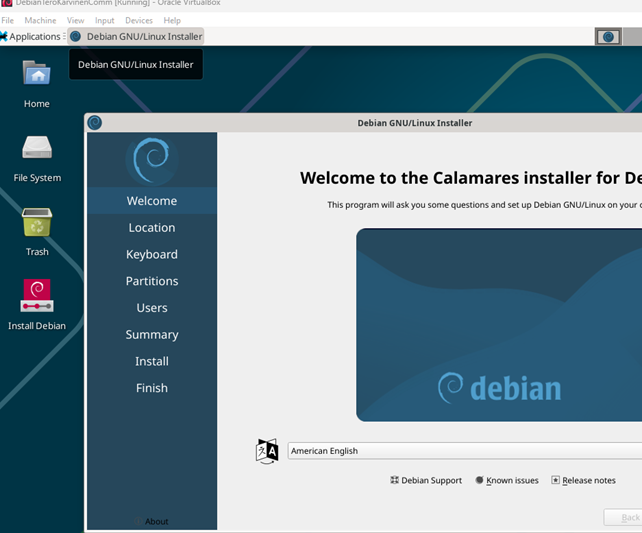
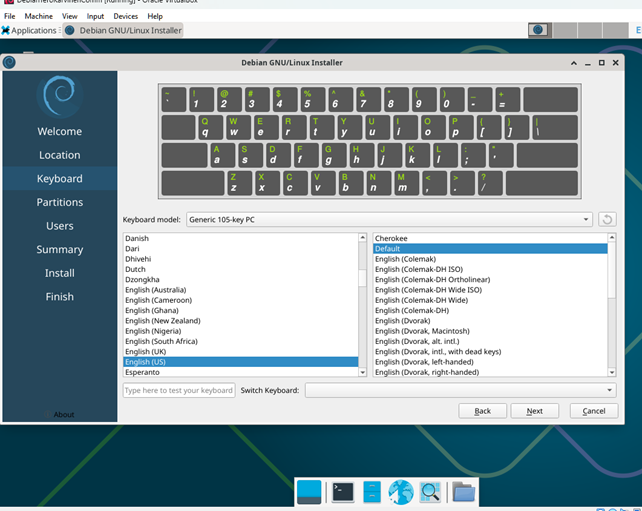
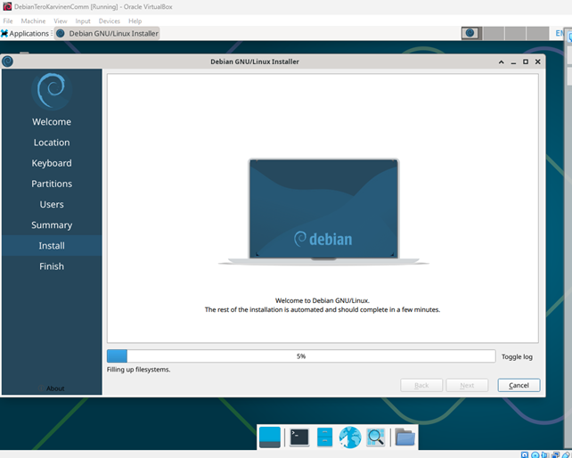
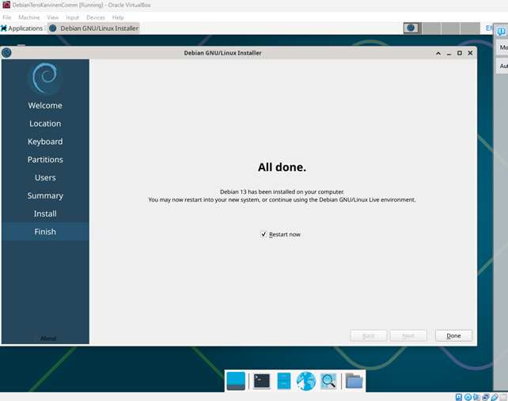
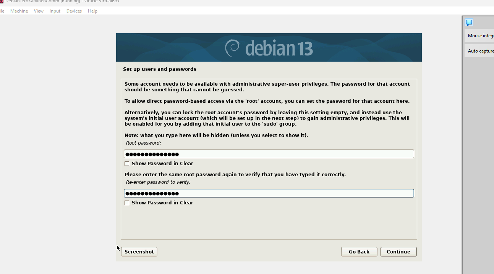

# Raportin kirjoittaminen

- Täsmällisyys selittäen selkeästi mitä komentoja on antanut ja tarkat kellonajat työvaiheisiin kuuluvasta ajasta.
- Helppolukuisuus väliotsikoita käyttäen ja kirjoita huolellista kieltä.
- Toistettavuus eli jos antaa raportin toiselle opiskelijalle pitää sama tulos tulla harhapolkuineen.

LÄHTEET   

Karvinen, T. Artikkeli. 2006. Luettavissa: https://terokarvinen.com/2006/raportin-kirjoittaminen-4/ Luettu 20.8.2025

# h1 Tehtävän raportti
Aloitin asentamisen 20.8. kello 19.30. Tietokoneeni on Fujitsu Lifebook E549 (Intel(R) Core(TM) i5-8265U CPU @ 1.60GHz  1.80 GHz). 
Ensiksi asensin virtuaalikoneen Virtualboxilla, jonka jälkeen asensin Debian/GNU Linuxin ISO -tiedostolla juuri luotuun virtuaalikoneeseen. 

Käytin asennuksessa uusinta saatavilla ollutta versiota, joka raportin tekohetkellä oli debian-live-13.0.0-amd64-xfce.iso.

Tässä asennusprosessissa hyödynsin sekä Teron (Karvinen, T. 2021) että Johannan (Heinonen, J. 2025) ohjeita.

## Virtuaalikoneen asennus
Asennuksen jälkeen lähdin määrittelemään asetuksia. 

* Valitaan Debian (64-bit), tyypiksi Linux
* Muistin kooksi 4000Mb, 
* Prosessorien (CPU) määräksi 2
* 60GB Tiedoston kooksi
* Hard disk file tyypiksi VDI (Virtualbox Disk Image) 
* Valitaan dynamically allocated.

Virtuaalikone ilmestyi tämän jälkeen Virtualbox Manageriin.

Klikkasin hiiren oikealla asetukset (settings) auki ja menin kohtaan "Storage". Valitsin Controller: IDE kohdasta CDROM "Empty". Attribuuteista CD-levyn kuvakkeesta aukesi ikkuna, jossa valittiin Virtual Optical Disk Fileksi aiemmin asennetun ja tallennetun ISO Disk imagen (debian-live-13.0.0-amd64-kde.iso).

Avasin juuri asennetun virtuaalikoneen Virtualboxista. Tuli virheilmoitus: ”Not in a hypervsor partition.” ”VT-X is disabled in the BIOS fo all CPU modes” (VERR_VMX_MSR-ALL_VMX_DISABLED).
Syötin virhekoodin Googleen ja löysin Youtubesta, miten enabloidaan virtualisointi Windows 11:lla. (Youtube, Bluestacks. 2021). 

Tulikin jälleen virheilmoitus, aiemmin ladattu ISO -tiedosto kaatoi virtuaalikoneen käynnistyksen. Alasvetovalikosta valitsemalla oikea ISO -tiedosto (debian-live-13.0.0-amd64-kde.iso) käynnistyi virtuaalikone nätisti.

Lähdin testaamaan virtuaalikoneen toimivuutta avaamalla selaimen ja Googletin ohjeistuksen mukaisesti ”TeroKarvinen.com” ja hakutulos aukesi onnistuneesti. Seuraavaksi lähdin asentamaan Debiania juuri luotuun virtuaalikoneeseen.

## Debian GNU/Linux installer
Asensin Debianin Live ISO -tiedostolla (debian-live-13.0.0-amd64-kde.iso), joka toi käyttöön Calamares-asennusohjelman. Käytettävissä olisi ollut myös toinen asennustapa (debian-cd/...iso-hybrid/), mutta valitsemalla Live ISO:n päädyin käyttämään Calamaresia, jolla halusin edetä. 

Lähdin Debian GNU/Linux Installerin pariin klikkaamalla työpöydän ”Install Debian” -kuvaketta. Lokaatioksi valitsin Finland, Kieleksi valitsin American English, näppäimistön kieleksi English US, Keybordiksi ”Generic 105-key PC (intl.).

Seuraavalle sivulle edetessä klikattin 
* Erase disk: Yes
* Encrypt: No, Boot loader location: ”Master Boot Record..”
* Valitsin nimeksi oman koko nimeni, kirjautuminimeni, tietokoneen nimen, kuitenkin poistaen oman nimi tietokoneen nimestä, sillä siitä tulee myös Public Domain nimi ja lopuksi vielä salasana ja jätetään automaattinen sisäänkirjautuminen tyhjäksi.
* Lopuksi klikattiin ”Install” napista.

Asennusvaihe kesti noin viisi minuuttia. 

Asennuksen valmistuttua ruksin ”Restart now” -ruudun ja lopuksi vielä klikataan "Done" -nappulaa.

Käynnistymisessä meni hetken aikaa ja melkein luuli jo asennuksen epäonnistuneen. Kyseessä olikin vain viive, tässä kohtaa kannattaa siis odottaa, kunnes Linux avautuu kunnolla. 

Avasin testiksi vielä Mozilla Firefoxin toimivuuden tarkistamiseksi, joka lähti toimimaan odotetusti.

## Terminal ja komennot tehtäviin päivityksiin ja asennukseen
Lähdin avaamaan Terminaalin käynnistyspalkin ikonista ja syötin komennon sudo apt -get update. Salasanan syöttämisen jälkeen päivittämisprosessi lähti käyntiin. 
Syötin komennon sudo apt-get -y dist upgrade eli päivitetään kaikki. 

Virhetilanne tosin tuli jälleen, kun syötin ylimääräisen välilyönnin komentoon. Klikkasin nuolta ylöspäin, jolla sain kopioitua koko komennon ja poistin välilyönnin välistä, ja päivittäminen alkoi, jossa meni hetki. 
Asensin tämän jälkeen palomuurin komennoilla: sudo apt-get -y install ufw ja sudo ufw enable. Sain vahvistuksen onnistuneeseen asennukseen tekstillä ”Firewall is active and enabled on system startup”. 

Lopuksi tein vielä uudelleenkäynnistyksen käynnistys navigointipalkin vasemmasta kuvakkeesta. Kirjauduin sisään tunnuksilla ja olimmekin päässeet tämän harjoituksen loppuun. Linuxin asennus oli onnistunut. Kello oli tässä kohtaa 17.10. 

Lopputulos

## Lähteet 
Bluestacks. Video. Youtube Enable Virtualization on Windows 11.
Katsottavissa: https://www.youtube.com/watch?v=t8f-zw_wcWM Katsottu: 20.8.2025.  

Debian install. Luettavissa: https://cdimage.debian.org/debian-cd/current-live/amd64/iso-hybrid/ 20.08.2025  

Heinonen, J. 2025. Update linux-20082025.md. Verkkosivusto. Luettavissa: https://github.com/johannaheinonen/johanna-test-repo/blob/main/linux-20082025.md/ Luettu 20.08.2025  

Karvinen, T. 2021. Install Debian on Virtualbox. Artikkeli. Luettavissa:https://terokarvinen.com/2021/install-debian-on-virtualbox/ Luettu 20.08.2025  

